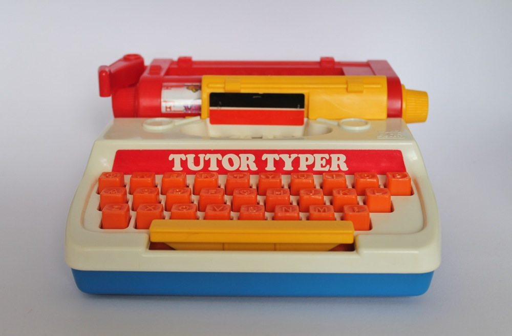

# tutor-typer



A very minimal static type-checker for learning and teaching purposes. Not really useful for anything, and it's not really meant to be.

## usage and examples

### quick summary

The main point of entry is `tutor-typer.core/type-check`, which takes either a
supported scalar literal or a quoted S-expression. The result will either be the type of the expression (if it typechecks), an `IllegalArgumentException` if it doesn't, or the keyword `:tutor-typer.core/unknown` if it doesn't know how to check the types.

### built-in function types

Currently, only the following functions have types:

* `+` : `[:number :number] -> :number`
* `-` : `[:number :number] -> :number`
* `div` : `[:number :number] -> #{:nil :number}` (returns nil instead of dividing by zero)
* `str` : `* -> :string`
* `default-to` : `[#{:nil T1} T2] -> #{T1 T2}` (like 2-arity `or`, but only checks for non-nil. `T1` and `T2` can be any two types.)

As you might guess from the above, union types are represented as sets.
That is to say, `div` might return either `:nil` type or `:number` type (yes, `nil` has its own type).
The `default-to` function is mostly included to take an optional type (like the result of `div`) and guarantee that it isn't `nil`, for example:

```clojure
(require '[tutor-typer :as t])

(t/type-check '(+ 1 (div 10 2)))
;; Type error: + expected [:number :number], actual [:number (t-maybe :number)]


(t/type-check '(+ 1 (default-to (div 10 2) 0)))
;; :number
```

### scalar types

The following scalar types are also supported:

* `"string"`        -> `:string`
* `nil`             -> `:nil`
* `:keyword`        -> `:keyword`
* `1`, `0.1`, `1/2` -> `:number`

### defining types

At this early stage, you can't really define any types of your own without modifying `tutor-typer.core/fn-types` or `tutor-typer.core/scalar-preds`. This will change soon (hopefully), but here's how types work anyway:

* Function types are just functions. They take a vector of argument types (say, `[:number :number]` for `+`) and return either the return type (`:number`) or they throw a type error. The type of `str` is just `(constantly :string)`, because `str` is always guaranteed to return a string no matter what arity or types it gets called with.
* Any type can be wrapped in a set, usually with other types, to represent a union type. For example, a function with the domain `[#{:nil :number} :number]` could take either `nil` or a number for the first argument, but the second argument must be a number.
* It's perfectly fine for the return type of a function to be a union. The return type of `div`, for example, is `#{:nil :number}`.

There are also a few helper functions available:

* `t-union` : returns the union of the given 2+ types
* `t-maybe` : returns a type that is either `:nil` or the given type
* `fn-type` : returns the type for a function with the given name (for error reporting), argument vector (of types), and return type. For example, the type of `div` is `(fn-type "div" [:number :number] (t-maybe :number))`. It's not the most powerful way to define function types, but it generates pretty decent type errors.

## future plans

* Offloading as much as possible to core.typed.
* Algebraic data types.

## license

Copyright © 2015 Justin Holguín

Distributed under the Eclipse Public License either version 1.0 or (at
your option) any later version.
